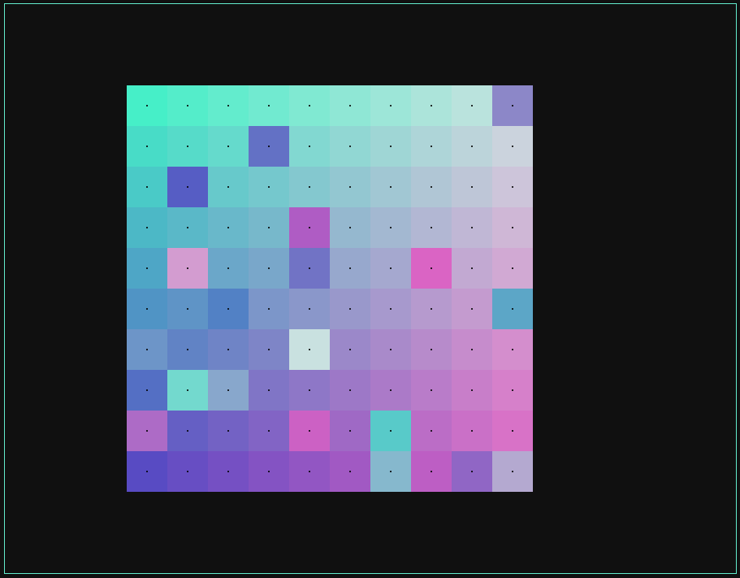
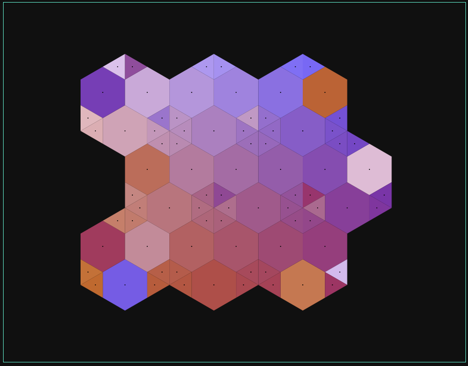

## The project
This is a POC to build a puzzle game in TypeScript. Is is completely inspired by the smartphone game **I Love Hue** from "Zut!"
To complete a level, sort every tile by color.

Here are a few screenshot:

## Running
Everything you need is in dist folder.

Open `index.html` on your favorite browser.
  
## Dev
### Installation
-  `npm install`

### Bundle-ification
- Edit typescript files (.ts) in src folder
- Run `npx webpack` at the root of project

## Side notes
This game manages grid with axis that are 90° (ortho) or 60° (hexa). Note that there is **always** one axis (called X axis) that is **horizontal**. Take this into account when designing a grid.

There is no specific documentation but the code is as clear as possible. To figure out how to use the "game engine", check `preset.ts` out.
In that file, I use grid generators to create different type of grid with unique pattern.

File names are pretty obvious. 
`color.ts` handles almost everything related to color stuff: Color interface, color gradient generation, preset color gradient.
`shape.ts` declares every shape needed and how to draw it.
`gridGenerator.ts` is a bit technical. It essentially contains two functions that, given a pattern, generate an ortho or hexa grid. 
`index.ts` is the entry point of the javascript. It handle user interactions with the game
